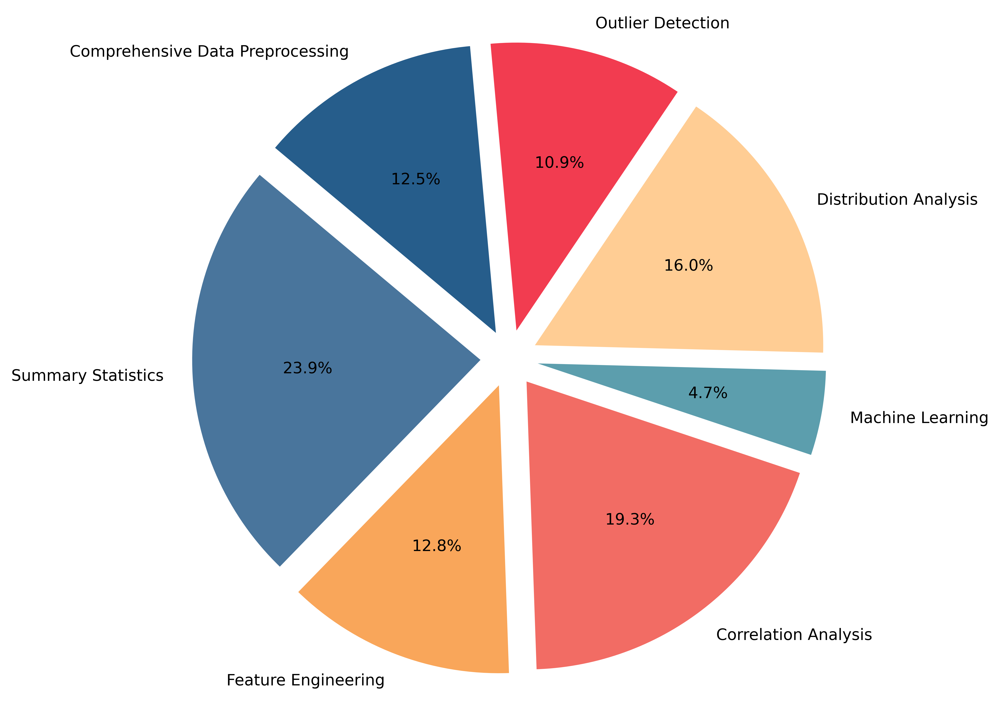

# Evaluation
In this section, we introduce the details of evaluation benchmark and evaluation pipeline. 

## Dataset construction

We contruct the evaluation dataset with the following procedures:

- Files Collection
- Description Generation
- Concepts Determinations
- Open-ended Question Generation
- Constraints and Format Requirements Generation
- Ground Truth Gathering & Filtering
- Manual Check

We first collect some existing csv files from GitHub. We split the evaluation into different topics, like correlation analysis and generate the related query. Considering the high-performance of OpenAI ADA, we borrow its generated results as reference initialization for high-quality annotation. 

## Statistics

We split the dataset into validation set and test set. The validation dataset contains 400 questions with 72 csv files. It is open to public and the test set is used for avoiding data leakage. All the subsequent information is based on the validation set. Here're some examples of the generated questions:

We categorize CSV files within the dataset into nine distinct categories, determined by their respective domains:

- Finance and Economics

- Health and Medical
- Demographics and Social Science
- Marketing and Consumer Behavior
- Energy and Environmental Monitoring
- Transportation, Logistics, and Tourism
- Culture, Entertainment, and Media
- Scientific Research and Technology
- Other Categories

Below is the pie chart depicting the categorical distribution:

We conduct statistical analyses on the individual concepts associated with each question, accounting for scenarios where a question encompasses multiple concepts:

This table illustrates the distribution of questions based on the number of underlying concepts they encompass :

| #concepts      | #1   | #2   | #3   | #4   | Total |
| -------------- | ---- | ---- | ---- | ---- | ----- |
| **#questions** | 187  | 112  | 11   | 1    | 311   |

This table presents statistical findings regarding our filtration process :

| #Unfiltered questions | #Filtered questions | #Unfiltered subquestions | #Filtered subquestions | Avg.  Sub-Questions per Question |
| --------------------- | ------------------- | ------------------------ | ---------------------- | -------------------------------- |
| 770                   | 400                 | 1442                     | 706                    | 1.76                             |

## Results

We set temperature=0.2, top_p=1.0 and frequency_penalty=0.0 for all the models on the validation set.

| Model                | PSAQ (%) | ABQ (%) | UASQ (%) |
| -------------------- | -------- | ------- | -------- |
| gpt-4-0613           | 65.26    | 59.75   | 66.05    |
| gpt-3.5-turbo-0613   | 55.35    | 47.25   | 52.21    |
| llama-2-7b           | 37.53    | 32.49   | 34.01    |
| code-llama-7b        | 47.59    | 39.59   | 44.67    |
| code-llama-python-7b | 47.03    | 40.86   | 40.78    |
| chatglm-3-6b         | 18.10    | 14.84   | 15.19    |

We draw a spider chart to show PSAQ with every concept:

We also report the ABQ where questions involved only one concept and more then one concepts.

| Model                | 1 concept (%) | >1 concepts (%) | Overall (%) |
| -------------------- | ------------- | --------------- | ----------- |
| gpt-4-0613           | 61.07         | 57.34           | 59.75       |
| gpt-3.5-turbo-0613   | 52.46         | 39.86           | 47.25       |
| llama-2-7b           | 41.60         | 19.58           | 32.49       |
| code-llama-7b        | 46.64         | 28.67           | 39.59       |
| code-llama-python-7b | 48.74         | 28.67           | 40.86       |
| chatglm-3-6b         | 18.10         | 10.07           | 14.84       |

