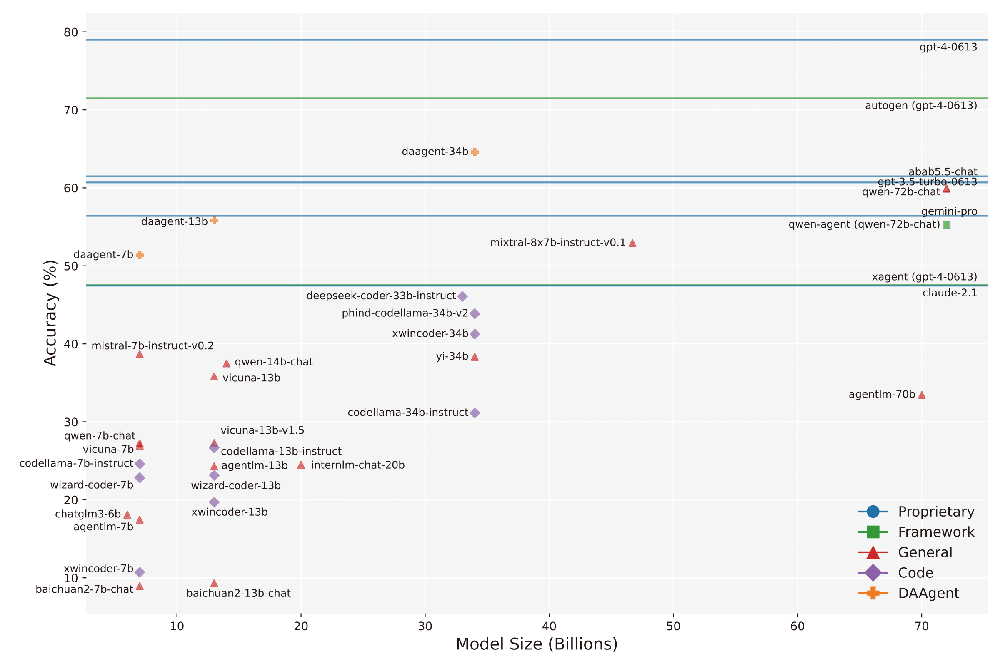
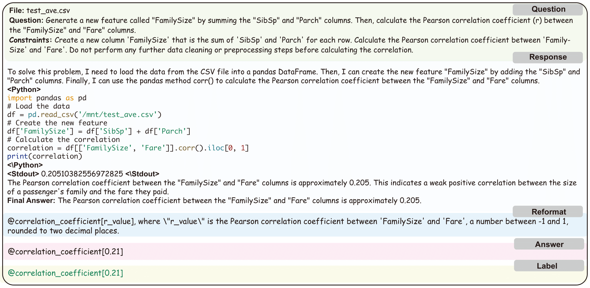

<h1 align="center">

<br>
InfiAgent-DABench: Evaluating Agents on Data Analysis Tasks (ICML2024)
</h1>


<div align="center">


</div>

<!-- 
[](https://github.com/InfiAgent/ADA-agent/blob/main/LICENSE)
[]
[]
[] -->

<p align="center">
  <a href="https://infiagent.github.io/"><b>[🌐 Website]</b></a> •
  <a href="https://arxiv.org/abs/2401.05507"><b>[📜 Paper]</b></a> •
  <a href="https://huggingface.co/datasets/infiagent/DABench"><b>[🤗 HF Models]</b></a> •
  <a href="https://github.com/InfiAgent/InfiAgent"><b>[🐱 GitHub]</b></a>
  <!-- <a href="https://9557c5365a6f44dc84.gradio.live"><b>[🐯 Gradio Demo]</b></a> -->
  <br>
  <!-- <a href="#-quick-start">Quick Start</a> • -->
  <!-- <a href="#%EF%B8%8F-citation">Citation</a> -->
</p>

<p align="center">
  
</p>

## 🔥 News

<!-- - [2023/11/29] 🔥🔥🔥 All models released at [🤗 HuggingFace](https://huggingface.co/llm-agents)! -->

## Introduction

InfiAgent-DABench is a project to build and evalute agents for advanced data analysis. Agent evaluation has been an open and challenging problem. It formulates LLMs as agents via a [REACT](https://arxiv.org/abs/2210.03629) pipeline. InfiAgent supports LLMs includinig local models (e.g., Llama) and API call (e.g.,  GPT-4). In this repo, we also build an evaluation benchmark and leaderboard to evaluate data analysis agents.


<!-- - The code for collecting data from GPT4 to train data analysis models.
- The code for training a LLM model. -->
<!-- - The **Evaluation Dataset** and **Evaluation Leadboard** to evaluate data analysis task. -->
<!-- 
## SFT Data Collection

<h1 align="center">

</h1>

The general collection process includes three steps, csv collection, query collection, multi-turn response data collection via InfiAgent pipeline, and a clearning step. Please follow the details in [Collection Commands](dataset_collection.md) to collect SFT data. -->
<!-- 

## LLM Training

In the fine-tuning of our model, we adopted the Vicuna format to organize the training data into a multi-turn chatbot-style arrangement, applying the FastChat training framework for implementation. Crucial hyperparameters were set, including a learning rate of 2e-5 and the employment of the AdamW optimizer paired with a cosine learning rate scheduler. For enhanced memory efficiency, we utilized Fully Sharded Data Parallelism (FSDP). The training was executed with bf16 precision and accommodated a maximum sequence length of 4096 tokens.

The training script can be found at the following script: [https://github.com/lm-sys/FastChat/blob/main/scripts/train_vicuna_7b.sh](https://github.com/lm-sys/FastChat/blob/main/scripts/train_vicuna_7b.sh). -->

<!-- There are two methods to get the  In closed-form evaluation, the model is required to generate the response in the specific way and we use the exact match to evaluate the performance.  -->


We provide an automatic evaluation for closed-form questions. In closed-form evaluation, the model is required to generated the response in the specific way and we use the exact match to evaluate the performance. Considering that most models hardly follow the format requirements, we add a reformat step after the models respond with GPT-3.5 which formats the responses with the format requirements. Here's a figure illustrating this process:



### Dataset


Our evaluation dataset includes a validation dataset and a test dataset. We only keep validation dataset for public.


The validation dataset comprises two .jsonl files, with each line representing a JSON-format dictionary containing the following keys. Additionally, a directory of CSV files for the associated questions is located under `data/`:

1. **Questions**: `data/da-dev-questions.jsonl`

- **id**: Unique identifier for each question.
- **question**: The description of the data analysis question.
- **concepts**: The concepts involved in the question.
- **constraints**: The constraints on the question that narrow down the solution into a closed-form.
- **format**: The format requirements for the output.
- **file_name**: The file name of the corresponding csv file.
- **level**: The difficulty level for each question.

2. **Labels**: `data/da-dev-labels.jsonl`

- **id**: Unique identifier for each question.
- **common_answers**: A list of labels in the format: `[[answer_name1, answer1],[answer_name2, answer2], ...]` which are corresponding to "@answer_name[answer]" in the format part of questions.

3. **Files**: `data/da-dev-tables`

### Usage

For closed-form questions, we provide a script for generating responses with InfiAgent framework in `./pipeline/activities/eval.py`. Please choose corresponding config in `./pipeline/configs/agent_configs` based on your model.

```bash
python3 eval.py --llm [YOUR_MODEL] --api_key [YOUR_API_KEY] --config_path [YOUR_CONFIG]
```

Also an evaluation script:

```bash
python3 eval_closed_form.py \
--questions_file_path data/da-dev-questions.jsonl \
--labels_file_path data/da-dev-labels.jsonl \
--responses_file_path [YOUR_RESPONSES_FILE_PATH]
```

The responses file should adhere to the JSONL format, with each line containing a JSON dictionary that includes the 'id' and 'response' fields, formatted as follows:

```json
{"id":0, "response":"The response with @answer_name[answer] for question 0 from your model."}
{"id":1, "response":"The response with @answer_name[answer] for question 1 from your model."}
```
In addition, we provide a script for reformatting:

```bash
python3 reformat.py \
--questions_file_path data/da-dev-questions.jsonl \
--responses_file_path [YOUR_RESPONSES_FILE_PATH] \
--model [YOUR_MODEL]
```

We use an API for reformatting by default, you should put your URL for calling and api key in `url.txt` and `api_key.txt` respectively in the same directory of the script. If you want to use your own model, you need to modify the script.

### DA-Agent
We release weights of DA-Agent 7b, 13b and 34b at [huggingface](https://huggingface.co/infiagent).


## Contact

If you have any questions, feedback, or would like to collaborate on this project, please feel free to reach out to us through huxueyu@zju.edu.cn. Your inquiries and suggestions are highly appreciated. 

Thank you for your interest in our work!


## Citation

If you find our repo useful, please kindly consider citing:

```
@misc{hu2024infiagentdabench,
      title={InfiAgent-DABench: Evaluating Agents on Data Analysis Tasks}, 
      author={Xueyu Hu and Ziyu Zhao and Shuang Wei and Ziwei Chai and Qianli Ma and Guoyin Wang and Xuwu Wang and Jing Su and Jingjing Xu and Ming Zhu and Yao Cheng and Jianbo Yuan and Jiwei Li and Kun Kuang and Yang Yang and Hongxia Yang and Fei Wu},
      year={2024},
      eprint={2401.05507},
      archivePrefix={arXiv},
      primaryClass={cs.CL}
}
```
